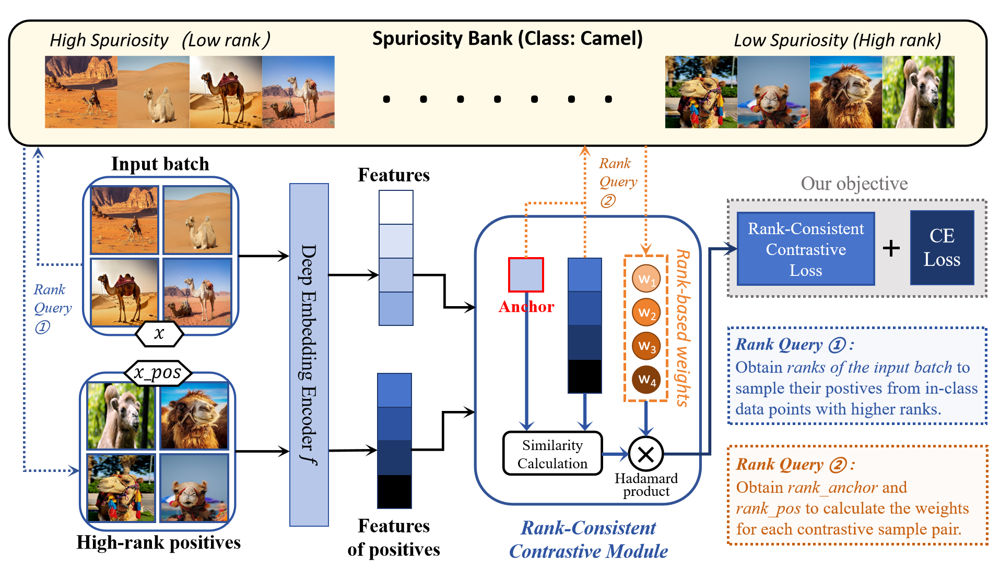

#  RaCCon: A Rank-Consistent Contrastive Learning Framework for Mitigating Spurious Correlations


<div align="center">
  
</div><br/>

## Abstract

Deep learning models often suffer from poor generalization under subpopulation shifts due to their reliance on unreliable spurious correlations (shortcuts). Recently, researchers have introduced spuriosity rankings, a quantitative metric reflecting the intensity of spurious correlations in each sample, to provide more fine-grained descriptions over coarse binary group annotations. This shift from discrete labels to a continuous spectrum allows for a more nuanced understanding of data spuriosity. However, a critical gap remains: existing strategies primarily employ spuriosity rankings for data selection, failing to leverage these rankings during the optimization process. Consequently, the remaining samples are treated uniformly, overlooking the inherent continuum of data spuriosity. 
To address this, we propose Rank-Consistent Contrastive Learning (RaCCon), which integrates spuriosity rankings as a structural constraint into the representation space. Specifically, RaCCon utilizes a rank-guided over-sampling mechanism to prioritize reliable low-spuriosity samples and a rank-aware re-weighting strategy with a smooth sinusoidal function to calibrate the influence of positive pairs with different rankings. By enforcing consistency between representation similarity and spuriosity rankings, our method effectively decouples core semantic features from spurious correlations without requiring explicit bias labels. Extensive experiments on UrbanCars and CelebA demonstrate that RaCCon consistently outperforms state-of-the-art baselines in worst-group accuracy. Ultimately, our work establishes a systematic, rank-aligned framework that effectively mitigates spurious correlations to enhance model robustness under subpopulation shifts. Our code will be available.
* * *

## Requirements

```shell
pip install -r requirements.txt
```

* * *

## Datasets
You can generate or download the datasets in the following way:
* UrbanCars: Generate the dataset with the following command.
```shell
bash scripts/prepare_dataset_models/create_urbancars.sh
```
* Multi-biased CelebA: Following the instructions from [Echoes](https://github.com/isruihu/Echoes) to generate this dataset.
* BAR: Download the dataset from [BAR](https://github.com/simpleshinobu/IRMCon).

## Implementation of RaCCon and other methods

Use the following command to run RaCCon on the chosen dataset:

```shell
bash scripts/train/raccon-$DATASET.sh
```
where `$DATASET` should be chosen from `urbancars`, `celeba` and `bar`.

For example, to train RaCCon on UrbanCars, use:

```shell
bash scripts/train/raccon-urbancars.sh
```

For other methods, we also provide sample scripts in `scripts/train`. All sample scripts are set to train on UrbanCars. 
To implement these methods on other datasets, just set `--dataset CelebA` or `--dataset BAR`. 

We find that the training procedure is largely influenced by the devices. In our own implementations, the optimal hyperparameters can be quite different for
various GPUs. Therefore, we recommend you to run a grid search on `--lr2` and `--classifier_weight` yourself.

## Acknowledgements

This code is based on the open-source implementations from the following projects:
- [A Whac-A-Mole Dilemma: Shortcuts Come in Multiples Where Mitigating One Amplifies Others (CVPR 2023)](https://github.com/facebookresearch/Whac-A-Mole)
- [Sebra: Debiasing through <u>Se</u>lf-Guided <u>B</u>ias <u>Ra</u>nking (ICLR 2025)](https://github.com/kadarsh22/Sebra).

